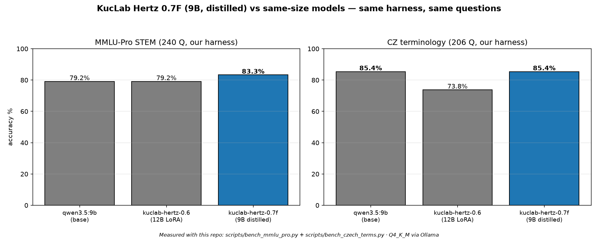

# KucLab Hertz 0.7F



*Measured on this project's harness — same 240 MMLU-Pro STEM and 206 CZ terminology questions for every model. Scripts: `scripts/bench_mmlu_pro.py`, `scripts/bench_czech_terms.py`.*

A Czech/English STEM + programming assistant built by [KucLab](https://kuclab.org) on top of **Qwen/Qwen3.5-9B**. Unlike the Gemma-based Hertz 0.x line, 0.7F is **distilled**: its training data was generated by a 30B teacher model (reasoning strength high, answer-first), then used to fine-tune the 9B student. It beats Hertz 0.6 — our previous best — on both of this project's benchmarks.

## What this is

Hertz 0.7F is a **LoRA fine-tune** (r=16, merged into the base weights) of Qwen3.5-9B:

- **Base:** Qwen/Qwen3.5-9B (~9B params, Apache 2.0)
- **Method:** QLoRA, r=16 / alpha=32, merged to bf16 then quantized
- **Teacher:** a 30B reasoning model served locally (temperature 0.2–0.7, answer-first system prompt with a canonical `Answer: (X)` final line on multiple-choice items)
- **Training data:** 4884 rows total — 4532 distilled rows (math, physics, chemistry, biology, programming, Czech language, English, plus numeric multiple-choice drills), 309 CS↔EN scientific-terminology rows with definitions (train split only — the benchmark's held-out quarter is never trained on), 28 answer-first formatting examples, 15 hand-written identity rows. Validated: 0 malformed, 0 duplicates, 0 identity leaks, 87.9% Czech.
- **Context:** 32768 tokens in the Ollama Modelfile (`num_ctx`).
- **Format available:** GGUF (q4_k_m, ~5.3GB) for `llama.cpp`/Ollama, plus the raw LoRA adapter on request.

## Quickstart (Ollama)

**Important:** `ollama pull hf.co/...` alone does NOT apply this model's system prompt (identity + personality). Use `ollama create` with the Modelfile below instead:

```bash
curl -O https://huggingface.co/KucLab/kuclab-hertz-0.7f/resolve/main/Modelfile
ollama create kuclab-hertz-0.7f -f Modelfile
ollama run kuclab-hertz-0.7f
```

(The Modelfile's `FROM` line points at `hf.co/KucLab/kuclab-hertz-0.7f:Q4_K_M`, so this pulls the same GGUF automatically.)

## The honest development story

0.7F exists because Hertz 0.7 (same Gemma-4-12B base as 0.6, bigger dataset) **regressed**: 70.8% STEM (vs 0.6's 79.2%) and 70.9% terminology (vs 73.8%). Diagnosis, verified on the corpora: the new bulk data was only 53% Czech (vs 93% before), diluting the exact Czech lexical signal, and 901 long reasoning rows taught rambling — unparseable answers jumped from 18/240 to 50 re-asks plus 33 unparseable. Rather than a third attempt on the same base, we switched strategy: a stronger teacher generates the data, a smaller student learns it.

Two export bugs were found and fixed along the way, both disclosed so others don't repeat them: Qwen3.5's MTP head makes `convert_hf_to_gguf` emit a phantom `blk.32` (block_count 33 instead of 32), which makes Ollama fail expecting SSM tensors that don't exist — fixed by setting block_count to the 32 real blocks and dropping the orphan MTP tensors. A hand-rolled GGUF metadata copy also taught us (twice) that `GGUFWriter` emits `GGUF.*` keys and `general.architecture` itself — copying them again corrupts the KV section.

## Benchmarks

Same prompts, same grading code, same Ollama Q4_K_M quantization, identical methodology throughout.

**MMLU-Pro STEM** (240 held-out questions, this project's own curated subset)

| | base (Qwen3.5-9B) | Hertz 0.6 (Gemma-12B LoRA) | **Hertz 0.7F** |
|---|---|---|---|
| Biology | — | 91.7% | **83.3%** |
| Chemistry | — | 61.7% | **78.3%** |
| Math | — | 90.0% | **96.7%** |
| Physics | — | 73.3% | **75.0%** |
| **Total** | — | **79.2%** | **83.3%** |

Hertz 0.7F beats Hertz 0.6 by +4.1pp overall, with the biggest gains exactly where 0.6 was weakest (chemistry +16.6pp, math +6.7pp). Biology regressed (83.3% vs 91.7%) — the distilled corpus was light on biology (~100 rows), a known weakness to address next.

**Czech terminology benchmark** (206 held-out CS↔EN scientific terms)

| | Hertz 0.6 | **Hertz 0.7F** |
|---|---|---|
| CS→EN | 82.5% | **88.3%** |
| EN→CS | 65.0% | **82.5%** |
| **Total** | **73.8%** | **85.4%** |

+11.6pp overall, and +17.5pp in the hard EN→CS direction — the distilled Czech prose (not term lists) is what fixed it.

**Standard benchmarks** (`lm-evaluation-harness`, bf16 merged weights, L4 GPU)

| Benchmark | Hertz 0.7F | Notes |
|---|---|---|
| GSM8K (strict-match) | **87.8%** | 1319 test questions, generative |
| GSM8K (flexible-extract) | **86.7%** | |
| Thinking tokens (20-probe meter) | **358 mean** | vs 679 for the Qwen3.5-9B base (−47%) |

Full `mmlu_pro` via `lm-eval` is running; `results.json` will be appended here.

## Honest status

- ✅ **MMLU-Pro STEM: 83.3%, beats Hertz 0.6 (79.2%)**
- ✅ **Czech terminology: 85.4%, beats Hertz 0.6 (73.8%)**
- ✅ Correctly identifies as a KucLab model (KucLab Hertz 0.7F, kuclab.org), no founder named
- ✅ Direct, no-hedging personality on ordinary topics; genuinely harmful requests still refused
- ⚠️ Biology (83.3%) is below 0.6's 91.7% — thin biology coverage in the distilled corpus
- ⏳ No tool-calling fine-tuning

## License

Apache 2.0, inherited from Qwen/Qwen3.5-9B.

## Credits

- Base model: [Qwen/Qwen3.5-9B](https://huggingface.co/Qwen/Qwen3.5-9B) (Qwen, Apache 2.0)
- Teacher for distillation: Meta Muse Glimmer 30B (local inference, reasoning strength high)
- Fine-tuning, dataset construction, and packaging: [KucLab](https://kuclab.org)
