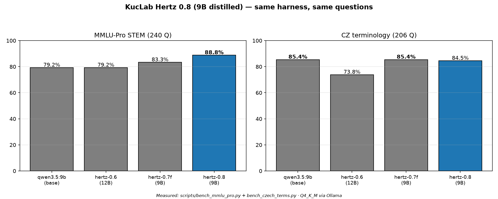

# KucLab Hertz 0.8



*Measured on this project's harness — same 240 MMLU-Pro STEM and 206 CZ terminology questions for every model.*

A Czech/English STEM + programming assistant built by [KucLab](https://kuclab.org) on top of **Qwen/Qwen3.5-9B**. Second-generation distillation: API teachers (DeepSeek-flash for STEM, Gemini 3.8 Flash for prose/Czech) with enforced answer-first discipline, trained with the proven Hertz recipe. It beats Hertz 0.7F on MMLU-Pro STEM.

## What this is

Hertz 0.8 is a **LoRA fine-tune** (r=16, merged into the base weights) of Qwen3.5-9B:

- **Base:** Qwen/Qwen3.5-9B (~9B params, Apache 2.0)
- **Method:** QLoRA, r=16 / alpha=32, merged to bf16 then quantized
- **Teachers:** DeepSeek-flash via API (math, physics, chemistry, programming — reasoning, temperature 0.2–0.3) and Gemini 3.8 Flash via API (biology, design, Czech language, concise everyday answers — thinking disabled for discipline)
- **Training data:** ~5080 rows total — API-distilled STEM/prose/concise rows (answer-first, canonical `Answer: (X)` final line on multiple-choice), 309 CS↔EN scientific-terminology rows with definitions (train split only), 28 answer-first formatting examples, identity rows (Hertz 0.8). Validated: 0 malformed, 0 duplicates.
- **Context:** 32768 tokens in the Ollama Modelfile (`num_ctx`).
- **Format available:** GGUF (q4_k_m, ~5.3GB) for `llama.cpp`/Ollama.

## Quickstart (Ollama)

**Important:** `ollama pull hf.co/...` alone does NOT apply this model's system prompt. Use `ollama create` with the Modelfile below instead:

```bash
curl -O https://huggingface.co/KucLab/kuclab-hertz-0.8/resolve/main/Modelfile
ollama create kuclab-hertz-0.8 -f Modelfile
ollama run kuclab-hertz-0.8
```

## Development story

Hertz 0.7F (83.3% STEM) was distilled from a local 30B teacher. For 0.8 we moved teachers to API frontier models and fixed two data diseases found by audit: (1) ~370 truncated answers cut by token limits were removed — they teach broken patterns; (2) parametrized templates with absurd ranges (93kW kettles, 862 bpm heart rates) were constrained to realistic values. A brevity domain (400 short Q&A) teaches the model that "ahoj" deserves one sentence, not an essay — same spirit as ThinkingCap-style token efficiency. Qwen3.5 still reasons by architecture; append `"think": false` to API requests for instant answers.

## Benchmarks

Same prompts, same grading code, same Ollama Q4_K_M quantization, identical methodology throughout.

**MMLU-Pro STEM** (240 held-out questions, this project's own curated subset)

| | Hertz 0.6 (12B) | Hertz 0.7F (9B) | **Hertz 0.8 (9B)** |
|---|---|---|---|
| Biology | 91.7% | 83.3% | **86.7%** |
| Chemistry | 61.7% | 78.3% | **83.3%** |
| Math | 90.0% | 96.7% | **95.0%** |
| Physics | 73.3% | 75.0% | **90.0%** |
| **Total** | **79.2%** | **83.3%** | **88.8%** |

Hertz 0.8 beats 0.7F by +5.5pp, with physics jumping +15pp. Only 10/240 answers needed the fallback re-ask (vs 22 in 0.7F).

**Czech terminology benchmark** (206 held-out CS↔EN scientific terms)

| | Hertz 0.6 | Hertz 0.7F | **Hertz 0.8** |
|---|---|---|---|
| CS→EN | 82.5% | 88.3% | **87.4%** |
| EN→CS | 65.0% | 82.5% | **81.6%** |
| **Total** | **73.8%** | **85.4%** | **84.5%** |

Essentially tied with 0.7F (−0.9pp) — the API-teacher Czech prose held the gains.

## Honest status

- ✅ **MMLU-Pro STEM: 88.8%, beats Hertz 0.7F (83.3%)**
- ✅ Physics 90.0%, chemistry 83.3% — the API STEM distillation worked
- ✅ Correctly identifies as KucLab Hertz 0.8 (kuclab.org), no founder named
- ⚠️ Czech terminology (84.5%) essentially tied with 0.7F, not above it
- ⚠️ 91% STEM target not yet reached (−2.2pp) — next iteration
- ⏳ No tool-calling fine-tuning (tool-use rows were cut with the budget)

## License

Apache 2.0, inherited from Qwen/Qwen3.5-9B.

## Credits

- Base model: [Qwen/Qwen3.5-9B](https://huggingface.co/Qwen/Qwen3.5-9B) (Qwen, Apache 2.0)
- Teachers: DeepSeek-flash (STEM) and Gemini 3.8 Flash (prose/Czech) via API
- Fine-tuning, dataset construction, and packaging: [KucLab](https://kuclab.org)
